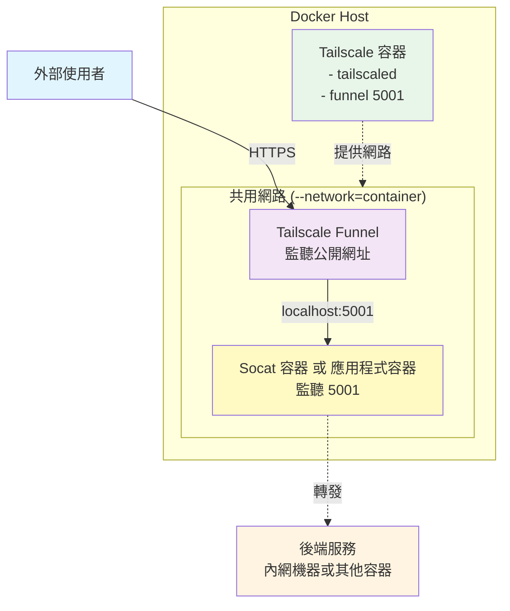
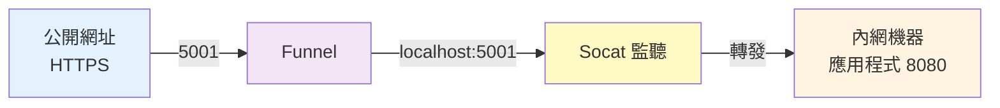

# Tailscale Funnel 內網服務公開存取

## 前置需求

1. **Tailscale 帳號**：前往 [Tailscale 官網](https://tailscale.com/) 註冊（免費）
2. **Docker 環境**：Docker Desktop 或 Docker Engine
3. **內網機器**（可選）：
   - 如果用內部 IP 轉發（`192.168.x.x`）→ 不需要安裝 Tailscale
   - 如果用 Tailscale 節點名稱轉發 → 內網機器需安裝 Tailscale（[下載](https://tailscale.com/download)）

## 這是什麼？

使用 Tailscale Funnel + Docker，讓內網服務可以公開存取。

**特色**：
- ✅ 免費 HTTPS 網址（`https://你的名稱.taileXXXXX.ts.net/`）
- ✅ 簡單切換不同環境
- ✅ 不需要設定 NAT 或申請憑證

**範例網址**：`https://my-service.taileXXXXX.ts.net/`  
查看你的 Tailscale 網域：[Admin Console](https://login.tailscale.com/admin/settings/general) → Settings → General → Tailnet name

---

## 架構圖



**Socat 轉發方式**：
- 同網段：用內部 IP（`192.168.x.x`）
- 不同網段：用 Tailscale 節點名稱（需內網機器安裝 Tailscale）

---

## 兩種使用方式

**方式 1：Socat 轉發** - 服務在其他內網機器上  
**方式 2：應用程式容器** - 服務在 Docker Host 上

切換方式：停止目前容器，啟動另一個即可。

---

## 開始建立容器

### 步驟 1: 建立 start.sh 腳本

**在你的電腦上建立一個資料夾和腳本檔案**:

```bash
# Windows
mkdir D:\docker\tailscale
cd D:\docker\tailscale

# Linux/Mac
mkdir -p ~/docker/tailscale
cd ~/docker/tailscale
```

**建立 `start.sh` 檔案，內容如下**:

```bash
#!/bin/sh
tailscaled & 
sleep 2 
tailscale up
tailscale funnel 5001
```

**腳本說明**:
- `tailscaled &` - 啟動 Tailscale 背景服務
- `sleep 2` - 等待服務啟動
- `tailscale up` - 連接到 Tailscale 網路（如果有 TS_AUTHKEY 環境變數會自動使用，否則會顯示登入網址）
- `tailscale funnel 5001` - 開啟 Funnel，監聽 5001 埠號

> **重要**: 如果你想用其他埠號（不是 5001），在這裡修改 `tailscale funnel 5001` 中的數字

---

### 步驟 2: 建立 Tailscale 容器

**Windows**:
```bash
docker run -d --name=my-service-tailscale --hostname=my-service-tailscale --volume=D:\docker\tailscale:/var/lib/tailscale --volume=/dev/net/tun:/dev/net/tun --cap-add=NET_ADMIN --cap-add=SYS_MODULE --restart=always --entrypoint=/bin/sh tailscale/tailscale:latest -c "sh /var/lib/tailscale/start.sh"
```

**Linux/Mac**:
```bash
docker run -d --name=my-service-tailscale --hostname=my-service-tailscale --volume=$HOME/docker/tailscale:/var/lib/tailscale --volume=/dev/net/tun:/dev/net/tun --cap-add=NET_ADMIN --cap-add=SYS_MODULE --restart=always --entrypoint=/bin/sh tailscale/tailscale:latest -c "sh /var/lib/tailscale/start.sh"
```

**需要修改的地方**:
1. `--hostname=my-service-tailscale` ← 改成你想要的名稱（會影響公開 URL 的前半部）
2. `D:\docker\tailscale` (Windows) 或 `$HOME/docker/tailscale` (Linux/Mac) ← 改成步驟 1 建立的資料夾路徑

**執行後，查看登入網址**:
```bash
docker logs my-service-tailscale
```

你會看到類似這樣的輸出：
```
To authenticate, visit:

https://login.tailscale.com/a/xxxxxxxxxx
```

**點擊該網址，在瀏覽器中登入你的 Tailscale 帳號，完成認證**

**不需要改的地方**:
- `--volume=/dev/net/tun:/dev/net/tun` ← VPN 需要的設備，保持不變
- `--cap-add=NET_ADMIN` 和 `--cap-add=SYS_MODULE` ← VPN 需要的權限，保持不變

**執行後確認**:
```bash
# 查看容器是否正常運行
docker ps | grep my-service-tailscale

# 查看 Funnel 狀態
docker exec my-service-tailscale tailscale funnel status
```

---

### 步驟 3: 建立 Socat 容器

**這個容器做什麼？**  
將公開網址的流量轉發到內網機器（可用內部 IP 或 Tailscale 節點名稱）。

**埠號關係說明**:



- `5001`: Docker 容器內部的埠號（Funnel 和 Socat 都用這個，必須一致）
- `8080`: 內網機器上應用程式實際執行的埠號（可以不同）

**單一環境**：

```bash
# 用內部 IP 轉發（同網段）
docker run -d --name=my-service-socat --network=container:my-service-tailscale alpine/socat:latest tcp-listen:5001,fork,reuseaddr tcp:192.168.1.100:8080

# 或用 Tailscale 節點名稱（不同網段）
docker run -d --name=my-service-socat --network=container:my-service-tailscale alpine/socat:latest tcp-listen:5001,fork,reuseaddr tcp:internal-machine.taileXXXXX.ts.net:8080
```

**多環境切換**：

```bash
# 建立多個 Socat 容器
docker run -d --name=socat-dev --network=container:my-service-tailscale alpine/socat:latest tcp-listen:5001,fork,reuseaddr tcp:192.168.1.10:8080
docker run -d --name=socat-prod --network=container:my-service-tailscale alpine/socat:latest tcp-listen:5001,fork,reuseaddr tcp:192.168.1.20:8080

# 切換環境
docker stop socat-dev && docker start socat-prod
```

**查詢 Tailscale 節點名稱**：`tailscale status` 或查看 [Admin Console](https://login.tailscale.com/admin/machines)

**執行後確認**:
```bash
# 查看容器是否正常運行
docker ps | grep my-service-socat

# 測試轉發是否正常（在內網機器上先啟動你的應用程式）
curl https://my-service.taileXXXXX.ts.net/
```

> ⚠️ **如果遇到 "unconfigured" 錯誤**：重啟 Socat 容器即可
> ```bash
> docker restart my-service-socat
> ```
> 這是因為 Socat 容器啟動時，Tailscale Funnel 可能還沒完全準備好

---

## 日常使用

**切換環境**：
```bash
docker stop socat-dev && docker start socat-prod
```

**啟動應用程式容器**（停掉 Socat）：
```bash
docker stop my-service-socat
docker run -d --name=my-service-app --network=container:my-service-tailscale 你的應用程式映像檔
```

---

## 重要提醒

**同時只能運行一個服務容器**（埠號 5001 會衝突）

**修改埠號**：同步修改 `start.sh`、Socat 和應用程式容器的埠號設定

**`--network=container`**：讓容器共用 Tailscale 的網路，Socat 和應用程式容器都需要加這個參數

**Funnel 限制**：只支援 HTTP/HTTPS（Web、API、Webhook），不支援資料庫、SSH 等協定

---

## 另一個用途：Tailnet 內部 HTTPS 服務

如果你**不想公開到網際網路**，而是想讓 **Tailnet 內部成員**透過 HTTPS 存取服務，可以使用 `tailscale serve`。

**與 Funnel 的差異**：
- **Funnel**：公開網際網路可存取（任何人知道 URL 就能存取）
- **Serve**：只有 Tailnet 內部成員能存取（需登入 Tailscale）

### 在現有容器上加入 Tailscale

如果你的應用程式容器已經在運行（例如 `my-service-app`），讓 Tailscale 使用應用程式的網路：

**建立 start.sh**（不使用 funnel）：

```bash
#!/bin/sh
tailscaled & 
sleep 2 
tailscale up
tailscale serve status
wait
```

**建立 Tailscale 容器**（共享應用程式的網路）：

```bash
# Windows
docker run -d --name=my-service-tailscale --network=container:my-service-app --volume=D:\docker\tailscale:/var/lib/tailscale --volume=/dev/net/tun:/dev/net/tun --cap-add=NET_ADMIN --cap-add=SYS_MODULE --restart=always --entrypoint=/bin/sh tailscale/tailscale:latest -c "sh /var/lib/tailscale/start.sh"

# Linux/Mac
docker run -d --name=my-service-tailscale --network=container:my-service-app --volume=$HOME/docker/tailscale:/var/lib/tailscale --volume=/dev/net/tun:/dev/net/tun --cap-add=NET_ADMIN --cap-add=SYS_MODULE --restart=always --entrypoint=/bin/sh tailscale/tailscale:latest -c "sh /var/lib/tailscale/start.sh"
```

**註冊內部 HTTPS 服務**（只需執行一次）：

```bash
docker exec my-service-tailscale tailscale serve --bg http://localhost:5001
```

Tailnet 成員可透過 `https://my-service.taileXXXXX.ts.net/` 存取（需在本機登入 Tailscale）

**停止服務**：
```bash
docker exec my-service-tailscale tailscale serve reset
```

---

## 快速檢查

```bash
# 檢查容器狀態
docker ps | grep my-service

# 檢查 Funnel 狀態
docker exec my-service-tailscale tailscale funnel status

# 測試公開網址
curl https://my-service.taileXXXXX.ts.net/
```

---

## 常見問題

**無法存取公開網址**：
```bash
# 確認 Funnel 狀態
docker exec my-service-tailscale tailscale funnel status

# 確認有服務在監聽 5001
docker ps | grep my-service
```

**Socat 轉發失敗**：
```bash
# 查看 Socat 日誌
docker logs my-service-socat

# 測試內網機器連線（如果用 Tailscale 節點名稱）
docker exec my-service-tailscale ping internal-machine.taileXXXXX.ts.net

# 或測試內部 IP（如果用內部 IP）
docker exec my-service-tailscale ping 192.168.1.100
```

**遇到 "unconfigured" 錯誤**：重啟 Socat 容器
```bash
docker restart my-service-socat
```

**Windows 路徑問題**：用 `/` 或用引號包起來
```bash
--volume=D:/docker/tailscale:/var/lib/tailscale
# 或
--volume="D:\docker\tailscale:/var/lib/tailscale"
```

**查詢內網機器節點名稱**：在內網機器執行 `tailscale status`

---

## 其他替代方案

### 如果你需要自訂網域名稱

Tailscale Funnel 使用固定的 `*.ts.net` 網域，無法自訂。如果你需要使用自己的網域（例如 `api.yourcompany.com`），可以考慮以下方案：

#### 方案 1: Cloudflare Tunnel（推薦）

**優點**：
- ✅ 支援自訂網域
- ✅ 免費 HTTPS 憑證（透過 Cloudflare）
- ✅ 免費 DDoS 防護
- ✅ 同樣不需要設定 NAT/Port Forwarding

**缺點**：
- ⚠️ 環境切換較慢（DNS 更新有延遲）
- ⚠️ 流量會經過 Cloudflare 邊緣網路

**適合情境**：
- 需要專業品牌形象（自訂網域）
- 固定環境，不常切換
- 公開服務或商業用途

**基本設定**：
```bash
# 1. 安裝 cloudflared
# 下載：https://developers.cloudflare.com/cloudflare-one/connections/connect-apps/install-and-setup/installation/

# 2. 登入並建立 tunnel
cloudflared tunnel login
cloudflared tunnel create my-tunnel

# 3. 設定 DNS
cloudflared tunnel route dns my-tunnel app.yourdomain.com

# 4. 建立設定檔 config.yml
tunnel: my-tunnel
ingress:
  - hostname: app.yourdomain.com
    service: http://localhost:8080
  - service: http_status:404

# 5. 執行
cloudflared tunnel run my-tunnel
```

---

#### 方案 2: 傳統反向代理

在有公開 IP 的 VPS 上架設 Nginx/Caddy，完全掌控所有設定。

**優點**：完全掌控  
**缺點**：需要 VPS、設定複雜、需要維護

---

### 方案選擇建議

| 使用情境 | 推薦方案 | 原因 |
|---------|---------|------|
| 內部工具、Webhook | Tailscale Funnel | 設定最簡單，環境切換靈活 |
| 需要自訂網域 | Cloudflare Tunnel | 免費且專業 |
| 需要頻繁切換環境 | Tailscale Funnel + Socat | 秒級切換 |
| 商業正式環境 | Cloudflare Tunnel 或 VPS | 有 SLA 保障 |
| 個人專案/測試 | Tailscale Funnel | 最快上手 |

---

## 更多資源

**Tailscale 相關**：
- 📚 [Tailscale Funnel 官方文件](https://tailscale.com/kb/1223/funnel)
- 💬 [Tailscale 社群論壇](https://forum.tailscale.com/)

**其他工具**：
- 🔧 [Socat 使用手冊](http://www.dest-unreach.org/socat/doc/socat.html)
- ☁️ [Cloudflare Tunnel 官方文件](https://developers.cloudflare.com/cloudflare-one/connections/connect-apps/)
- 🌐 [Cloudflare Zero Trust Dashboard](https://one.dash.cloudflare.com/)

---

**🎉 設定完成！享受無痛的內網服務公開存取吧！**
